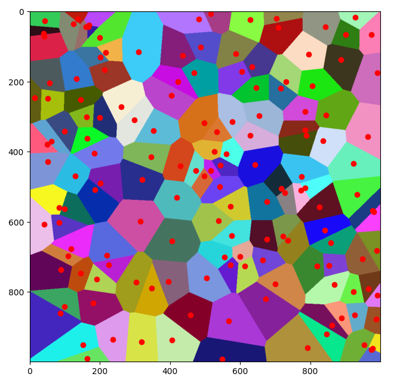

# Uvod

Voronoijevi diagrami nam predstavljajo neko ravnino razdeljeno na območja. Območja so oblikovana z pomočjo točk, ki jim bomo v nadaljevanju imenovali semena. Vsako seme ima okoli sebe območje, ki vsebuje vse točke, ki so po razdalji najbližje temu semenu. Za lažjo predstavo bodo v vseh slikah vsako območje obarvano z svojo barvo. 

V nadaljevanju si bomo pogledali tri različne načine z katerimi pridemo do Voronoijevih diagramov. Prvi način bo z naivno oziroma brute force metodo, drugi pa z izboljšavo prve metode. Tretji način pa bo tako imenovana Delaunayova triangulacija, ki pa je čisto svoj algoritem. Izkaže se, da ko dobimo triangulacijo in naredimo njen dual, dobimo ravno Voronoijeve diagrame.

Delaunayeva triangulacija se tudi v današnjem času uporablja v računalniški grafiki, saj nam pomaga razdeliti neko ploskev na skupek trikotnikov. Današnje grafične kartice so narejene tako, da prikazujejo oblike sestavljene iz trikotnikov in ravno za to je Delaunayeva triangulacija zelo uporabna.

Za lažjo predstavo, si lahko pogledamo naslednjo sliko, kjer imamo ravnino velikosti 1000 x 1000 in 100 semen. Voronoijev diagram bi izgledal sledeče:

# Zgodovina

Ideja o Voronoijevih diagramih se je v zgodovini večkrat pojavila, prvi pa jih je definiral Georgy Feodosevich Voronoy, ki je leta 1908 objavil študijo o n-dimenzionalnih Voronoijevih diagramih. Voronoy, se je rodil leta 1868 in je že v srednji šoli napisal svoj prvi matematični članek in že takrat je začel sodelovati z različnimi profesorji.

# Brute force metoda

 Ideja brute force metode že po imenu pove, da bo zelo potratna, a bo preprosta za razumeti. Vzemimo za primer ravnino iz $N * N$ točk na kateri je $M$ semen. Za vsako točko na ravnini pogledamo razdaljo do vseh $M$ semen in najdemo tisto seme, kateri je najbližje. N koncu vemo, h katerem semenu spada ta točka in jo pobarvamo z njegovo barvo. Potem nadaljujemo z računanjem razdalj na naslednji točki.
 Že kratek opis nam pove, da je dela ogromno, saj je potrebno izračunati $M$ razdalj za vsako točko in le teh je $N * N$. Tako je časovna zahtevnost danega algoritma $O(N^2 * M)$

# Jump Flood algoritem

Pri tem algoritmu bomo delovali ravno nasprotno kot pri Brute force, saj se ne bomo premikali, po še ne pobarvanih točkah ampak bomo začeli barvati iz semen in tako, po večih iteracijah pridemo do enakega rezultata. Že v naprej opozorilo, da algoritem ne deluje 100% natančno, saj z tem ko pohitrimo delovanje izgubimo na natančnosti. Ko spoznamo algoritem si bomo pogledali tudi, kako se lotimo tudi napak.

Ponovno imamo $N * N$ mrežo in pa $M$ semen. Za naš algoritem, je potrebno definirati še korak K:\
$K \in \{N/2, N/4, ..., 1\} - korak$\
Kot je razvidno, se bo ta korak v vsaki iteraciji zmanjšal za polovico, dokler ne pride do $1$.\
Algoritem bo deloval tako, da se bomo v eni iteraciji sprehodili čez vse semena in pogledali njihove sosede. Pri tem bomo sosede $Q$ določali na način: \
$Q = (x+i, y+j),\ kjer\ sta\ i,\ j \in \{-k, 0, k\}$\
To pomeni, da iz vsakega semena pogledamo 8 smeri. Seveda, če z korakom pridemo izven naših meja tistega soseda izpustimo.

Ko obravnavamo soseda se lahko pojavita dve možnosti in sicer, da je že pobarvan ali pa ne.\
$Q$ še nima barve $\Rightarrow$ Pobarvamo ga z barvo, ki jo ima trenutno seme. $Q$ dodamo med semena, in ga bomo tako v naslednji operaciji upoštevali kot seme.

$Q$ že ima barvo $\Rightarrow$ primerjamo razdaljo med trenutnim semenom in sosedom, in pa razdaljo med sosedom in tistim semenom, h kateremu trenutno spada sosed. Če je razdalja trenutnega semena in soseda manjša od druge, soseda prebarvamo z barvo semena, ki ga trenutno obravnamavo.

Z tem algoritmom pridemo do časovne zahtevnosti $O(N^2 * Log_{2}N)$. Če primerjamo časovno zahtevnost z brute force metodo, vidimo, da imamo enkrat $N^2$ množen z $M$ drugič pa z $Log_{2}N$. Tako je razvidno, da bi pri majhnem številu semen hitreje dobili rezultat z brute force metodo, vendar pa ko se število semen poveča, z Jump Flood algoritmom pospešimo delovanje.

## Primer 1:

## Primer 2:

### Napake in različice jump flood algoritma

Pri jump flood algoritmu, pa zaradi preskakovanja pride tudi do napak. V večini primerov, so te zanemarljive, saj imamo ponavadi ogromno število točk in semen, in tudi če je kakšna točna napačno označena v celoti ne igra bistvene vloge. Vendar kljub temu obstajajo načini, da število napak še zmanjšamo. Vse nadgradnje algoritma dodajo nek korak med naše osnovne korake $K$ in tako poskrbijo, da se določena območja natančneje pregledajo. Nadgradnje algoritma so naslednje:

- JFA + 1 : $K \in \{N/2, N/4, ..., 1, 1\}$
- JFA + 2 : $K \in \{N/2, N/4, ..., 1, 2, 1\}$
- 1 + JFA : $K \in \{1, N/2, N/4, ..., 1\}$

Opazimo, da algoritmi dodajo korak, ki pregleda najbližje sosede ponovno in tako odpravijo napake, ki ležijo ob meji dveh različnih območij. V naslednjem grafu, je razvidno, kako se število napak spreminja glede na število semen.

# Delaunay triangulacija

### Delaunay definicija

Denimo, da imamo v 2D prostoru točke A, B, C, D. Ustvarimo dva trikotnika ABD in BCD, ki si delita stranico BD.
Dva trikotnika skupaj tvorita štirikotnik, katerega razpolovi njuna skupna stranica BD. Pravimo, da velja
Delaunay triangulacija, če kota, ki si nasprotujeta in nista "presekana" z stranico BD skupaj sestavljata kot, ki je 
manjši od 180 stopinj.

### Zanimive lastnosi

Na wiki viru.

## Triangulacija algoritem

### Deli in vladaj (Divide and conquer)

Algoritem deluje na principu deljenja problema na manjše pod probleme katere rekurzivno združimo skupaj, da dobimo 
končni rezultat. 

Opomba: Izračunan rezultat velja le za konveksno ogrinjačo na množici točk.

Algoritem po korakih:

Denimo, da imamo množico 10 točk, prikazano na sliki 1

#### 1 - Urejanje točk

Točke nato uredimo po velikosti:

- Najprej po x-koordinatah
- V primeru, da imata dve točki enako x-koordinato uredimo še po y-koordinati

#### 2 - Rekurzivno polovično deljenje (Divide)

Postopoma delimo na dele ali celice, ki vsebujejo skupke največ 3 točk. 

Torej med dvema točkama, ki sta na sredini ustvarimo mejo. Nato na vsaki strani postopoek ponovimo. Ponavljamo dokler 
nam ne ostanejo celice, ki vsebujejo največ 3 točke in najmanj 2 točki.

Točke v vsaki celici povežemo skupaj, tako nastanejo trikotniki oziroma daljice med točkami.

#### 3 - Rekurzivno Lepljenje (Merge - Conquer)

Sledi lepljenje. Celice bomo postopoma spajali skupaj, tako, da bomo ohranjali Delaunay-ovo triangulacijo. Torej bomo
ustvarjali nove povezave, katire bodo tvorile trikotnike, ki zadostiju Delaunajevemu pogoju.
Rekurzivno lepimo po istem zaporedju kot smo točke razdelili na celice.

##### 3.1 - Spajanje

Spajamo torej dve celici (ali podmnožici točk), ki sta si sosednji, imamo levo celico in desno celico pri tem za lažje
razumevanje v prihodnosti definiramo izraze za poimenovanje povezav:

- **LL** = Vse povezave iz leve celice (obe točki povezave se nahajajo v levi celici)
- **RR** = Vse povezave iz desne celice (obe točki povezave se nahajajo v desni celici)
- **LR** = Nove povezave med levo in desno celico (ena točka v levi celici druga pa v desni)

Za ohranjanje Delaunajeve triangulacije bo v določenih primerih potrebno nekatere LL in RR povezavi odstraniti (izbrisati),
nikoli pa nebomo ustvarjali novih LL ali RR povezav.

Če spojimo torej celici iz zgornje primera:

V zgornjem primeru je bilo spajanje precej enostavno saj smo samo ustvarili nove trikotnike med dvema celicama. 

Zato si bomo na podrobnejše pogledali spajanje zgoraj nastalih celic, saj bo le to prikazalo natančen potek algoritma.

Spodnji pod-algoritem iteriramo.

**Ustvarimo bazno LR povezavo**

Bazna LR povezava je najbolj spodnja povezava med levo in desno celico, ki ne seka nobene LL ali RR povezave.

Od tod se premikamo navzgor, da določimo naslednjo LR povezavo nad bazno povezavo. Pri tem opazimo, da bo na novo nastala
povezava sigurno vsebovala eno od dveh točk ki določajo bazno LR povezavo, druga točka pa bo vsebovana na drugi strani.

Izbiro zožamo tako, da izberemo dve kandidatni točki, eno iz leve strani, drugo iz desne strani. Začnimo z desno stranjo:
Kandidate izbiramo zaporedoma po velikosti kota, ki ga povezava med kandidatom in desno točko LR baze tvori. 

Za vsakega potencialnega kandidata nato preverimo če zadostuje pogojem:

**I)** Kot med bazno LR povezavo in povezavo desne točke do kandidata mora biti manj kot 180 stopinj

**II)** Očrtana krožnica trikotnika ki jo tvorita obe točki bazne LR povezave in kandidata nesme vsebovati naslednjega
kandidata

Prvi kandidat zadostuje prvemu pogoju ne pa drugemu.

Ločimo na primere, ko kandidat zadostuje:

- I. in II. veljata = Kandidat postane naš končni kandidat (izbranec)
- I. ne velja = Ne izberemo nobenega kandidata za desno stran
- I. velja II. ne velja = Izbrišemo povezavo RR, ki jo tvori desna točka bazne LR povezave in kandidatna točka

Pogoje nato izvedemo na naslednjih korakih dokler:

1) Dobimo izbranca (končnega kandidata)
2) Ugotovimo, da noben kadidat iz desne strani ne bo izbran

Po izbrisu slabe povezave najdemo našega izbranca.

Isto storimo za levo stran kjer je postopek simetričen:

Ob končanem postopku določanja kandidatov na obeh straneh nam ostanejo 3 možnosti:

I) Iz obeh strani nismo dobili nobenega "izbranca" = Zaključimo, spajanje je končano

II) Dobimo "izbranca" le iz ene strani = Izbranca oz. točko povežemo z točko bazne LR povezave, ki se nahaja na drugi strani

III) Dobimo oba "izbranca" = Primerna LR povezava je izbrana glede na spodnji test:

Če desni izbranec ni vsebovan v notranjosti očrtanega kroga, ki ga določa trikotnik bazne LR povezave in levega izbranca:
    
Levi izbranec določa novo povezavo med njim in desno točko bazne LR povezave. 

Nasprotno velja za levega izbranca (če levi ni vsebovan, desni določa novo povezavo)

Po zagotovljenem obstoju Delaunajeve triangulacije bo vsaj eden zadostoval zgornjemu pogoju.

Po unikatnosti Del. triangulacije bo natanko eden zadostoval pogoju (razen v primeru, ko so 4 točke ko-planarne).

Enkrat, ko je nova povezava dodana je celoten proces ponovljen tako, da nova povezava postane bazna LR povezava.

Če ponovimo postopek, do konca:

Tako dobimo našo končno Delaunajovo triangulacijo:

# Kako povezati točke

# Primer v drugih metrikah

# Primeri uporabe

